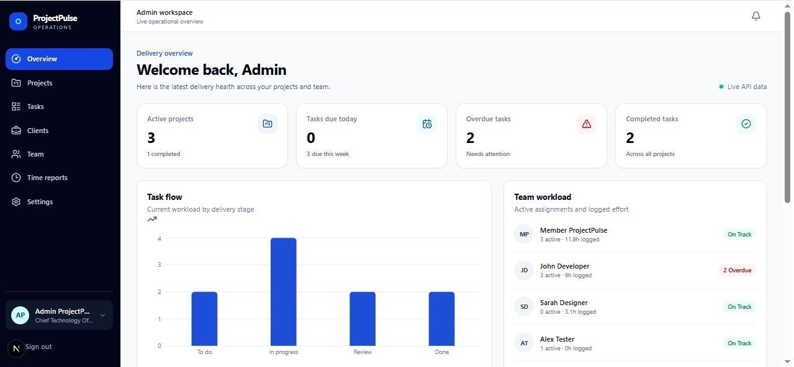
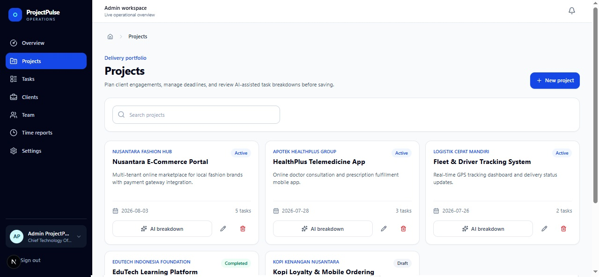
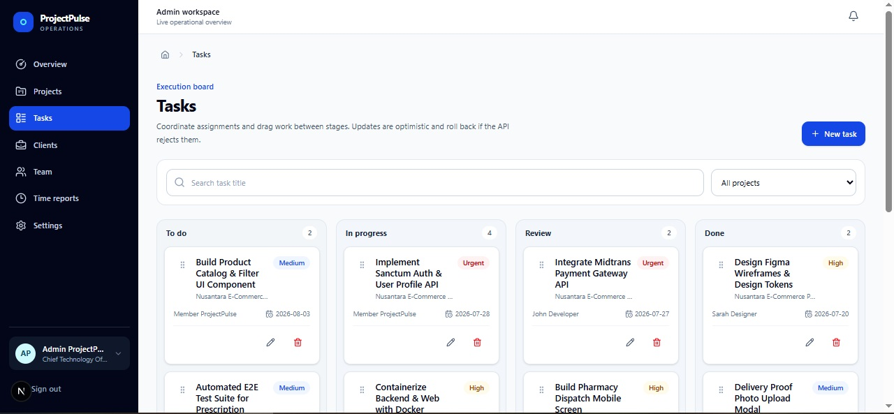
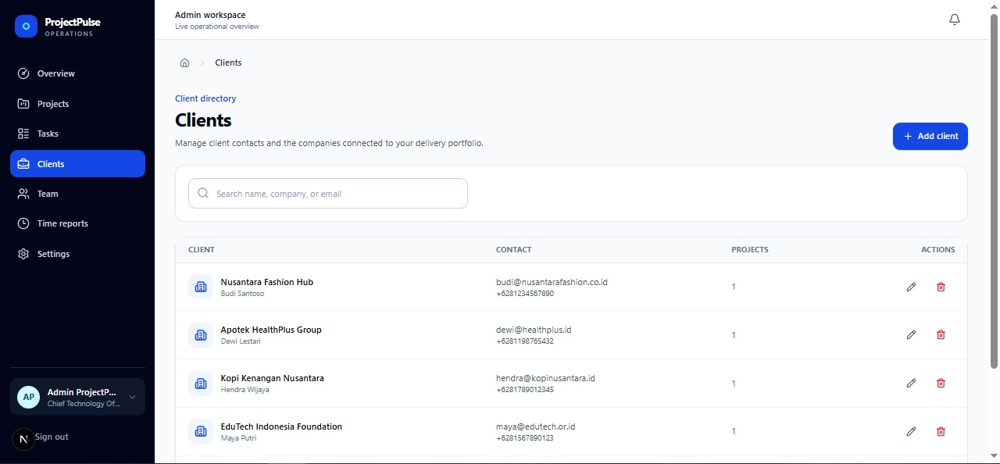
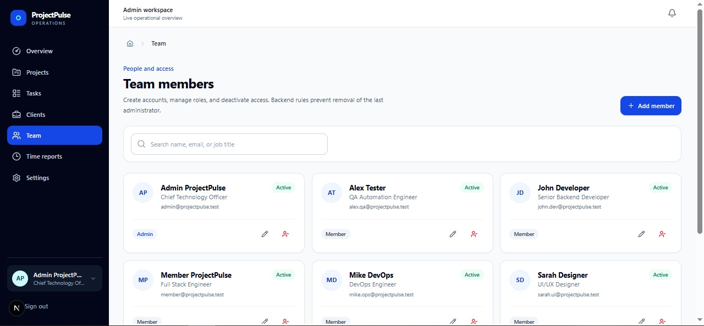
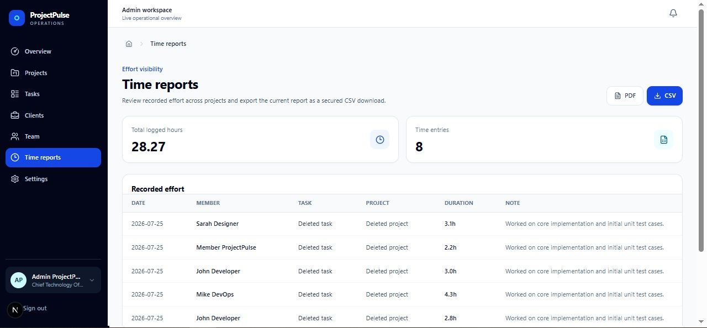
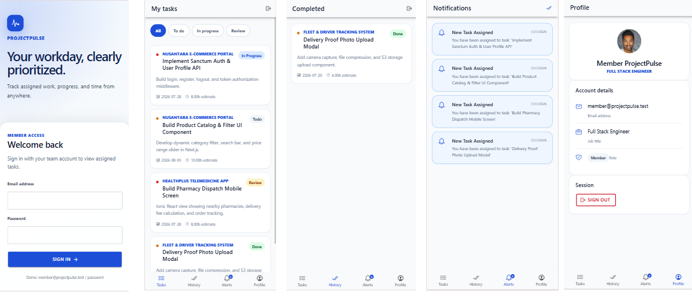

# ProjectPulse

ProjectPulse is a full-stack internal delivery platform for client, project, task, and team-productivity management. It includes a Next.js admin workspace, an Ionic/Capacitor member app, and a shared Laravel API backed by PostgreSQL.

## Screenshots

### Admin Web Dashboard

| Overview | Projects |
|:---:|:---:|
|  |  |
| Live delivery dashboard with task flow chart, team workload, and key metrics. | Project portfolio with search, AI-assisted task breakdown, and status badges. |

| Tasks (Kanban) | Clients |
|:---:|:---:|
|  |  |
| Drag-and-drop Kanban board with priority labels, assignees, and project filters. | Client directory with contact details, linked projects, and quick actions. |

| Team Members | Time Reports |
|:---:|:---:|
|  |  |
| Team management with role badges, status indicators, and access controls. | Recorded effort table with total hours, CSV and PDF export. |

### Member Mobile App



From left to right: **Login** screen, **My Tasks** list with status filter chips, **Completed** history, **Notifications** with assignment alerts, and **Profile** with session management.

## What is implemented

- Admin web: token login, live dashboard, client/project/member CRUD, AI task-breakdown review, task CRUD, drag-and-drop Kanban, time reports with CSV export, and notifications.
- Member mobile: token login/session restore, assigned-task filters, task detail, validated status transitions, time entries, progress notes, completed history, unread notification badge/list, and logout.
- Backend: Sanctum tokens, role and active-account middleware, scoped authorization, Form Requests, API Resources, consistent errors, pagination/filtering, reporting, comments, notification scheduling, AI provider abstraction (OpenAI/Gemini), AI audit trail, retry/timeout/normalization, and transactional bulk task creation.
- Operations: separate production Dockerfiles, Docker Compose, PostgreSQL, queue and scheduler processes, Kubernetes probes/resources/HPA/migration Job, GitHub Actions, OpenAPI, and Postman assets.

## Stack

| Layer | Technology |
|---|---|
| API | Laravel 12, PHP 8.3, Sanctum, PostgreSQL |
| Web | Next.js App Router, TypeScript, Tailwind, TanStack Query, RHF/Zod, Recharts, dnd-kit |
| Mobile | Ionic React, Capacitor 7, TypeScript, TanStack Query, RHF/Zod, Ionic Storage |
| Runtime | FrankenPHP, Node 20 standalone output, PostgreSQL 16 |
| Orchestration | Docker Compose, Kubernetes, Nginx Ingress, HPA |

## Demo accounts

After seeding:

| Client | Email | Password |
|---|---|---|
| Admin web | `admin@projectpulse.test` | `password` |
| Member mobile | `member@projectpulse.test` | `password` |

These credentials are demo-only. Change or remove them outside local/test environments.

## Run with Docker Compose

Prerequisites: Docker with Compose v2.

```bash
cp backend/.env.example backend/.env
cp web/.env.example web/.env.local
cp mobile/.env.example mobile/.env
```

Generate an application key on a machine with PHP and Composer installed:

```bash
cd backend
composer install
php artisan key:generate
cd ..
```

Then start and initialize the stack:

```bash
docker compose up --build -d
docker compose exec backend php artisan migrate --seed
```

Open:

- Admin web: <http://localhost:3000>
- API: <http://localhost:8000/api>
- Liveness: <http://localhost:8000/api/health>
- Readiness: <http://localhost:8000/api/health/ready>

The backend image does not run migrations on replica startup. Compose migrations are explicit; Kubernetes uses a single migration Job.

## Run locally without Docker

Backend:

```bash
cd backend
composer install
cp .env.example .env
php artisan key:generate
php artisan migrate --seed
php artisan serve
```

In separate terminals, start the database-backed worker and scheduler:

```bash
cd backend
php artisan queue:work --tries=3 --timeout=90
php artisan schedule:work
```

Web:

```bash
cd web
npm ci
cp .env.example .env.local
npm run dev
```

Mobile web preview:

```bash
cd mobile
npm ci
cp .env.example .env
npm run dev
```

The Android emulator reaches the host backend through the default `VITE_API_URL=http://10.0.2.2:8000/api`.

## Android

Prerequisites: Android Studio/SDK and JDK 21.

```bash
cd mobile
npm ci
npm run build
npx cap sync android
npx cap open android
```

Command-line debug build:

```bash
cd mobile/android
./gradlew assembleDebug
```

On Windows, use `gradlew.bat`. The generated APK is under `mobile/android/app/build/outputs/apk/debug/`.

## AI configuration

AI is assistive: project and manual task workflows remain available when a provider fails.

```env
AI_PROVIDER=openai
AI_TIMEOUT_SECONDS=20
AI_DEMO_FALLBACK_ENABLED=false
OPENAI_API_KEY=
OPENAI_MODEL=gpt-4o-mini
GEMINI_API_KEY=
GEMINI_MODEL=gemini-2.0-flash
```

Enable `AI_DEMO_FALLBACK_ENABLED=true` only for a deterministic offline demonstration. Provider payloads are normalized and bounded before being returned for admin review; suggestions are never persisted automatically.

## Kubernetes (local cluster)

Build images into the local cluster image store (example for Minikube):

```bash
minikube start
minikube addons enable ingress
minikube addons enable metrics-server
minikube image build -t projectpulse-backend:latest backend
minikube image build -t projectpulse-web:latest --build-arg NEXT_PUBLIC_API_URL=/api web
```

Create the real secret file:

```bash
cp k8s/secret.example.yaml k8s/secret.yaml
cd backend
php artisan key:generate --show
cd ..
```

Put the generated `APP_KEY` and a strong database password into `k8s/secret.yaml`, then:

```bash
make k8s-apply
```

Map the Minikube IP to `projectpulse.local` in the hosts file:

```bash
minikube ip
```

Inspect rollout:

```bash
kubectl get pods -n projectpulse
kubectl get ingress -n projectpulse
kubectl logs -n projectpulse deployment/projectpulse-backend
```

The raw manifests deliberately use local image names. For a registry deployment, replace them with immutable registry tags.

## Quality checks

```bash
cd backend
vendor/bin/pint --test
php artisan test

cd ../web
npm run lint
npm run build

cd ../mobile
npm run lint
npm run build
npx cap sync android
```

Or run the repository-level targets:

```bash
make test
make lint
```

## API documentation

- [OpenAPI contract](docs/openapi.yaml)
- [API guide](docs/api.md)
- [Postman collection](postman/ProjectPulse.postman_collection.json)
- [Postman environment](postman/ProjectPulse.postman_environment.json)

Import either the OpenAPI file or both Postman JSON files. The login request stores its returned token in the active Postman environment.

## Architecture and operations

- [Architecture](docs/architecture.md)
- [Database schema](docs/database-schema.md)
- [AI integration](docs/ai-integration.md)
- [Security](docs/security.md)
- [Testing](docs/testing.md)
- [Deployment](docs/deployment.md)
- [Technical decisions](docs/technical-decisions.md)
- [Final audit](docs/final-audit.md)

The admin workspace includes dedicated client/project/task detail and edit routes, a four-step AI-assisted project wizard, breadcrumb navigation, toast feedback, settings visibility, and CSV/PDF reporting. The member app includes task workflows, notification deep links, profile details, and logout.

## Future improvements

- Add Playwright browser journeys and native device UI automation beyond the current PHPUnit/Vitest coverage.
- Move browser/mobile bearer tokens to a same-origin HttpOnly-cookie BFF and hardware-backed mobile secure storage.
- Add visual regression screenshots for the responsive admin and mobile flows.
- Replace the dependency-free PDF renderer with a branded template engine when richer typography and charts are required.

## Security notes and deliberate trade-offs

- Authorization is enforced on the API; the web/mobile visibility rules are not security boundaries.
- Mobile tokens use Ionic Storage, which satisfies the technical-test requirement but is not hardware-backed. A public-store release should replace it with Keychain/Keystore-backed secure storage.
- The web client uses browser local storage for bearer-token persistence. A same-origin backend-for-frontend with secure HttpOnly cookies would reduce token exposure, but would change the required shared bearer-token architecture.
- Public registration is disabled by default. Admins provision members.
- The example Kubernetes secret contains no usable credentials and must not be applied unchanged.

See the final audit for evidence, environment limitations, and commands actually executed.
