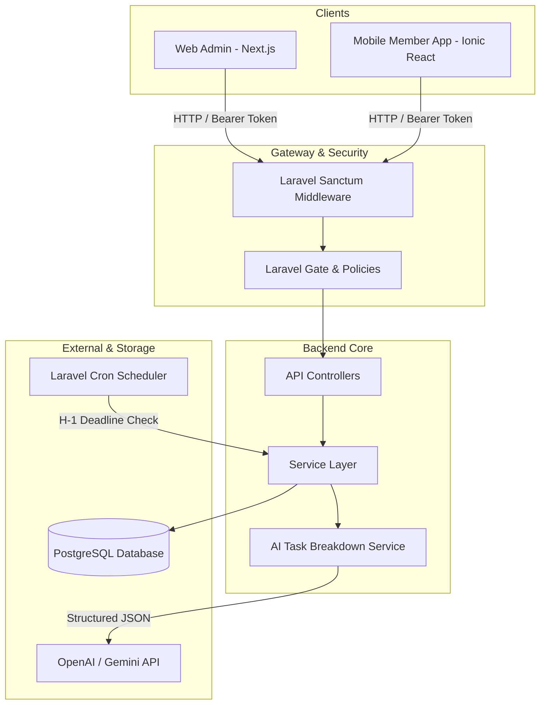

# ProjectPulse Architecture Document

## System Architecture Diagram



---

## Technology Stack Rationale

### 1. Backend: Laravel (PHP 8.3+)
- **Why**: Provides a mature, production-ready ecosystem for REST APIs with Sanctum for token authentication, built-in database migrations, Eloquent ORM, form requests validation, gate/policy authorization, queues, and task scheduling.
- **Service Layer Pattern**: AI orchestration and dashboard aggregation live in focused services (`TaskBreakdownService`, provider implementations, and `DashboardService`). Simple resource operations remain explicit in controllers to avoid ceremonial abstractions.

### 2. Database: PostgreSQL
- **Why**: Reliable ACID compliance, native JSONB support for logging AI task generation audits (`ai_task_generations`), expressive indexing capabilities, and high-performance aggregate operations for dashboard charts.

### 3. Web Admin: Next.js (App Router) / React / TypeScript
- **Why**: Modern full-featured web client structure with server/client state management using TanStack Query, React Hook Form + Zod schema validation, Tailwind CSS styling, Lucide icons, and dnd-kit for Kanban drag-and-drop.

### 4. Mobile: Ionic React / Capacitor
- **Why**: Cross-platform single codebase for Android-first delivery, leveraging React, Capacitor native packaging, Ionic components/storage, and mobile-optimized UI primitives.

---

## Core Data Flow

```text
Client (Web / Mobile)
  │
  ├── 1. Request with Bearer Token ──> Sanctum Middleware
  │                                           │
  ├── 2. Input Validation (Form Request) <────┤
  │                                           │
  ├── 3. Policy Authorization Check <─────────┤
  │                                           │
  ├── 4. Service Layer Execution <────────────┘
  │         │
  │         ├── DB Transaction / Eloquent ORM ──> PostgreSQL
  │         └── Assistive AI Execution ─────────> OpenAI / Gemini API
  │
  └── 5. Formatted JSON Response <── API Resource Format
```

---

## AI Resilience & Non-Blocking Design

1. AI serves strictly as an assistive tool to convert project client briefs into task breakdown suggestions.
2. Generating tasks does not immediately insert records into the database. Suggestions are returned to the Admin web interface for review, edit, addition, or removal.
3. If the LLM provider fails, times out (20s limit), or returns unparseable output, the backend returns a clean, structured `AI_PROVIDER_UNAVAILABLE` error message.
4. Admin can bypass AI suggestions and manually create projects/tasks without obstruction.
